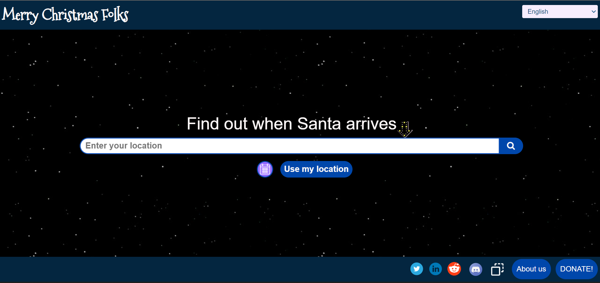
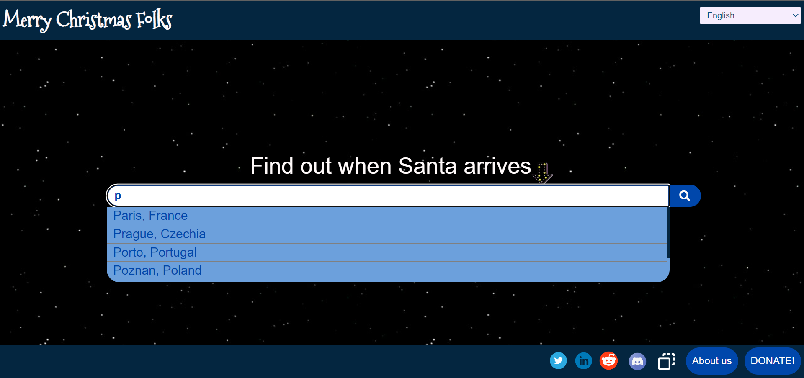
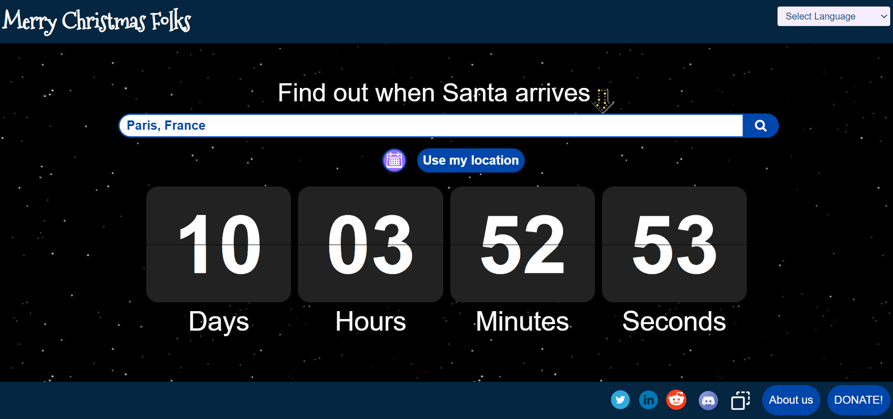
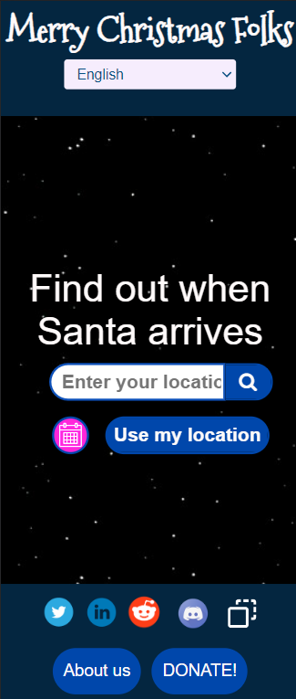
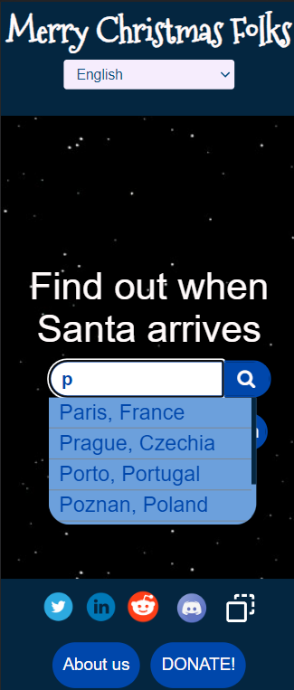
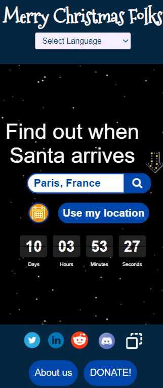
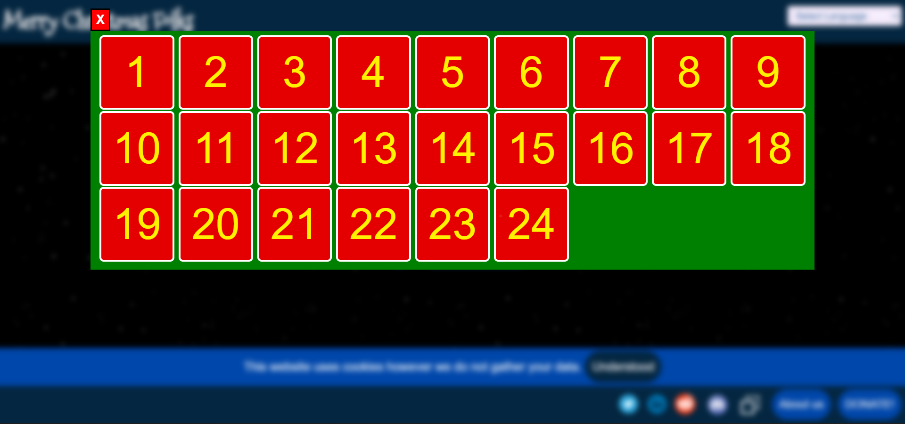
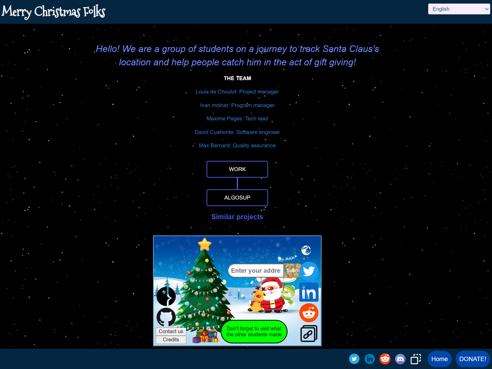

# **Functional Specifications**

# Table of contents

* [Project scope](#projectscope)
* [Requirements](#requirements)
* [Risks and Assumptions](#risks-and-assumptions)
* [Configuration](#configuration)
* [UI/UX](#uiux)
    * [The home page](#the-home-page)
    * [(optional) Gacha](#optional-gacha)
    * [The about us page](#the-about-us-page)
* [Calculating Santa's arrival time](#santa-arrival-time)
	* [The math](#the-math)
	* [Example](#example)
* [Sources](#sources)
* [Glossary](#glossary)

# Project scope

The end goal of this project is to create a website where users could look up when will Santa arrive with their presents.

- The end product must contain a search tool to look up addresses and, subsequently, Santa's arrival time to said addresses. 
    - To avoid unnecessary performance bottlenecks, the search tool must look up the addresses from a database linked with the project instead of using already existing APIs[^1].

- For the sake of this project, Santa always arrives exactly at solar midnight[^2] (midnight depending on the sun's position instead of the local time). Latitude coordinates[^3] can be ignored during the calculation of Santa's position.

- The website is expected to receive high levels of user traffic, therefore good performance is going to be essential for this project. The backend of the server must be able to function under peak load without overusing server resources otherwise.

- The frontend of the website is to be kept simplistic and easy to follow. Heavy assets, such as 3d models or large images must be avoided at all costs.

- The usage of Docker[^4] as a base technology has been imposed as an obligation by the client.

- Finding users for the working product is part of the development team's duties. For this end, the product must move into its production phase before the 25th of November 2022.

# Requirements

- The product must be realised in Docker.
- The product must be available online.
- The product must be able to function under heavy user traffic as well adapt to sudden changes in user traffic.
- It must be possible to search for locations using a search bar.
    - The search bar must draw its information from a database attached to the project, NOT an external API.
    - Geolocalisation button.
    - Search suggestions.
- The product must be able to calculate Santa's arrival time using the longitude obtained from the input address and the current time.
- In addition to the remaining time, the website must also show Santa's exact arrival time while taking into account the user's timezone. 
- (optional) The website must exist in multiple languages and allow the user to change the language the website is displayed in.
    - (optional) The website must detect the browsers language and display itself accordingly.
- (optional) A gacha[^6] system based Advent calendar could be put in place to touch into a slightly older target audience then the intended 5-15 years old range.
- (optional) Market research has show interrest in a functionality to display random facts related to christmass, reindeers, etc.

# Risks and Assumptions

- The maximum number of users at peak traffic is unknown.

- Most docker and database hosting services are blocked behind a paywall. It is assumed that every service necessary for the completion for the project has either a lax enough free tier or a free trial period large enough for the completion of the project.
    - If such services are not available, it is assumed that ALGOSUP[^5] will provide the development team with an account for a service that conforms to our needs.

- It is assumed that Docker is a viable technology for hosting the final website in an efficient and elastic manner.

- It is assumed that sending requests en masse to test the final product's performance is possible.

- It is assumed that a functional version of the project can be placed into production before the 25th of November 2022.

# Configuration

The user must be able to use the website without any additional effort necessary on their behalf (there is no need for logging in, etc..).

# UI/UX <span id="uiux"></span>

## The home page

The website must keep its style simple but Christmasy.

The home page must include:
- A header with a language selector
- A search bar
    - The search bar must have a placeholder that precises that it needs a location as an input.
    - The search bar must show suggestions.
    - In case the user launches the search without selecting a suggested location, the first suggestin must be selected.
- A geolocalisation button
- Once the user selects a location, a countdown must appear with the remaining time before Santa arrives (Days-Hours-Minutes-Seconds).
- A footer with links to the "about us" page and to a charity website.
    - Example for the charity website: https://don.unicef.fr/don-ponctuel-old/~mon-don?_cv=1

Home page as the user first sees it:


Home page while searching:


Home page with countdown:



The website must also be responsive.
|   |   |   | 
|---|---|---|
||||

## (optional) Gacha

One of the ways we could incentivize users to repeatedly come back to the website is to create an advent calendar.
As giving out chocolate trough the internet is rather difficult, a gacha[^6] system can be put in place.

This calendar must be accessible and visible on the home page.



## The about us page

A page with a small description on who we are and what are we trying to do in here.
This page must also contain links towards the websites of the other groups working on the same project.



# Calculating Santa's arrival time <span id="santa-arrival-time"></span>

## The math

Santa's exact arrival time will always be exactly 00:00 25th December, <u>solar time</u>.
Therefore, the following equation can be used to calculate the local solar midnight time in hours:

```
LT = DST + ((15 + Z - Lloc) / 15) - (E/60)
```

Where:

```
LT is the local time adjusted to day-saving time.
```

```
DST is an offset to count for Day Saving Time.
(DST=1 if time needs to be adjusted and DST=0 otherwise)
In December, daylight saving should always be 0.
```

```
Z is the GMT timezone of the location in question.
For example, Paris is in GMT+1, therefore for Paris Z=1.
```

```
Lloc is the Longitude coordinate of the location.
```

```
E is the equation of time in minutes.
As we will always be looking for the 24th of December, E is going to be constant in our case.

E = 0.3829280015475218
```

<details>
    <summary>How do we get this value?</summary>

    E = 0.258 * cos(B) - 7.416 * sin(B) - 3.648 * cos(2*B) - 9.228 * sin(2*B);

    B = 360 * (n - 1) * (pi/180) / 365.242

    Here, n is the day in the year, and B has its units in radians.
</details>

---

## Example

Let's take Vierzon, France as an example.

```
Vierzon's longitude = 2.0698
Vierzon GMT timezone = +1
```

Therefore:

```
LT = DST + ((15 * Z - Lloc) / 15) - (E/60)
LT = 0 + (15 * 1 - 2.0698) / 15 - 0.3829280015475218 / 60
LT = 0.85563119997
```

This means that Santa will arrive at precisely 0.85563119997 hours.

Consequently:

```
hours = floor(0.85563119997)
hours = 0

minutes = floor(0.85563119997 * 60)
minutes = 51

seconds = floor((0.85563119997 * 60) % 1 * 60)
seconds = 20
```

In this example, Santa will arrive at 00:51:20 on the 25th of December.

# Sources

- [Solar time calculator](https://koch-tcm.ch/wp-content/uploads/the-calculator.html)
- [How to calculate solar time](https://www.powerfromthesun.net/book.html)
- [How to calculate solar time (simplified)](https://faculty.eng.ufl.edu/jonathan-scheffe/wp-content/uploads/sites/100/2020/08/Solar-Time1419.pdf)
- [NORAD Santa Tracker vs Google Santa Tracker](https://www.pocket-lint.com/apps/news/131903-norad-tracks-santa-vs-google-santa-tracker-which-tracks-father-christmas-best)

# Glossary

[^1]: API : An Application Programming Interface (API) is a way for two or more computer programs to communicate with each other.

[^2]: Solar time: Solar time is a calculation of the passage of time based on the position of the Sun.

[^3]: Coordinates: The [Geographic Coordinate System (GCS)](https://en.wikipedia.org/wiki/Geographic_coordinate_system#Latitude_and_longitude) is a spherical or ellipsoidal coordinate system for measuring and communicating positions directly on the Earth as latitude and longitude.

[^4]: Docker: [Docker](https://www.docker.com/) is a set of platform as a service product that use OS-level virtualization to deliver software in packages called containers.

[^5]: ALGOSUP: [ALGOSUP](https://algosup.com/) is a software development school in Vierzon, France.

[^6]: Gacha: A [gacha game](https://en.wikipedia.org/wiki/Gacha_game) is a video game that implements the gacha (toy vending machine) mechanic.