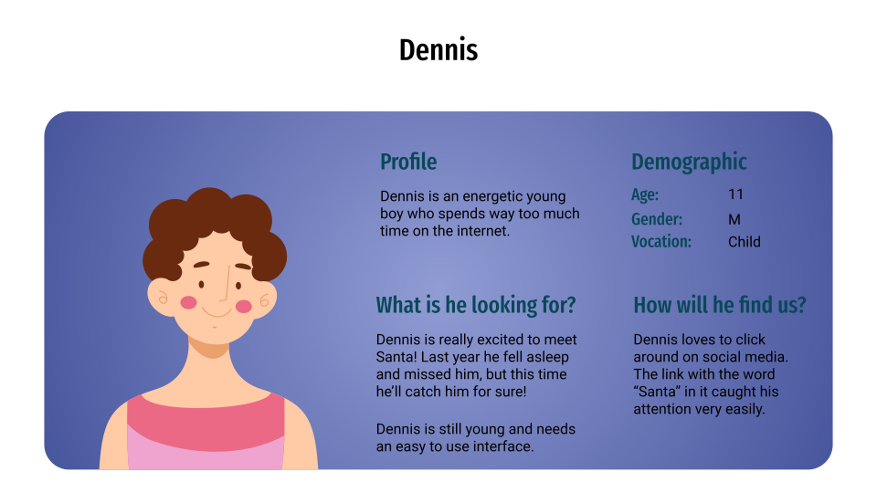
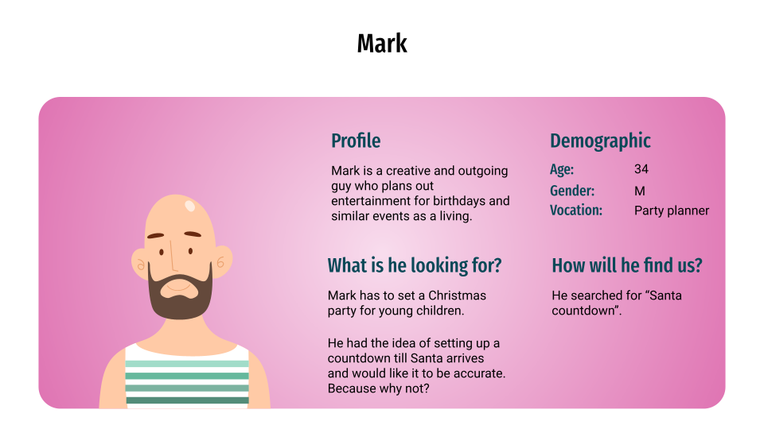
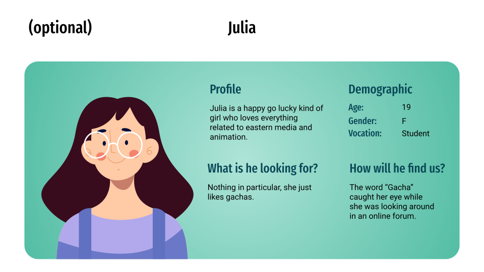

# **Marketing Specifications**

# Table of contents

* [Marketing mission](#marketing-mission)
* [Market research](#market-research)
* [Key performance indicators](#key-performance-indicators)
* [Personas](#personas)
* [Advertisment strategy](#advertisment-strategy)
    * [Advertisement on a personnal level](#advertisement-on-a-personnal-level)
    * [Social Media Marketing and Forum Based Advertisment](#social-media-marketing-and-forum-based-avertisment)
* [Competition](#competition)
    * [North American Aerospace Defense Command](#north-american-aerospace-defense-command)
    * [Google's Santa tracker](#googles-santa-tracker)
    * [Email Santa's Santa tracker](#email-santas-santa-tracker)
    * [Planefinder](#planefinder)
    * [Sky Q](#sky-q)
    * [Mobile applications](#mobile-applications)
* [SEO](#seo)

# Marketing mission

Our mission is to maximise website traffic until the 25th of December. Due to the project's nature, traffic should peak between 12PM 24th to 12AM 25th of December.
Therefore we have until the 24th of december to make the website as well known as possible.

<small>*This document has been separated from the functional specifications under the recommendation of Fabien GOULAMHOUSSEN.</small>

# Market research

The following form has been created for sake of product demand validation:
[Google form](https://forms.gle/ucnKXGWMtaWT9wYu5)

This survey has been shared both to the developpement teams personal connections and on https://www.reddit.com/r/SampleSize.

The answers to the survey consist of a list of recommendations to make the website more interesting as well as the following statistics.

Detailed answers received from the survey can be found [here](https://docs.google.com/spreadsheets/d/19plA9aklFpZFfaZvr5TJz5VEsMhbK4ZLhS_6mfdiDqg/edit?usp=sharing).

# Key performance indicators

Statistics of website traffic can be found on the Google Cloud Platform, for further details please consult our Technical Specifications.

Optionaly, a separate link can be prepared for every platform we advertise on.
This way it could be possible to measure which platforms bring in the most clicks.

# Personas

These are personas that represent potential users.

# Advertisment strategy

## Advertisement on a personal level

The final product must be advertised to personal connections of the development team.
This must be done before larger scale advertisement as the feedback from this will be essential in finding bugs in the freshly finished product.

## Social Media Marketing and Forum Based Avertisment

The website can be advertised in a variety of social media and online forums.
Examples of such sites are (but not limited to):

- Reddit
- Linkedin
- Twitter
- Discord

https://www.noel.gq/stats

# Competition

Our research indicates the following websites to be our main competitors:

Concurrent ALGOSUP groups:
- [Group 5's website](http://xmas.algosup.com/)
- [Group 6's website](http://santaclock.algosup.com/)
- [Group 8's website](http://santa.algosup.com/)

External competitors:

## [North American Aerospace Defense Command](https://www.noradsanta.org/en/)

NORAD's Santa Tracker is one of the oldest such sites.
It has a long history and is part of a long going tradition where children can call their hotline to report Santa's position.

| Strengths | Weaknesses | Opportunities | Threats |
|-----------|------------|---------------|---------|
|Very well known worldwide|Their website is outdated|Opportunity for self-promotion and recruitment|Google's Santa Tracker|
|They are traditional   |They are old (Since 1955)|Connection to older generations|Mostly North American|
|They are educational   |Hard to see color palet|Access to military budget|Tied to the military|
|They got their own gift shop|very heavy website|Collabs with flightTrackers|https://catchyoursanta.ml/|
|They got their own Youtube channel||||
|They have their own hotline for children to call||||
|Multilingual Map tracking|
|3D animations|
|Online games|
|Music|

## [Google's Santa tracker](https://santatracker.google.com/)

Google's Santa Tracker is the main competitor for NORAD's. 
Their main advantage over NORAD is their website, which is a lot more modern and appeals better to the younger generations.

| Strengths | Weaknesses | Opportunities | Threats |
|-----------|------------|---------------|---------|
|Awesome website        |Website can be overwhelming|Opportunity to influence the younger generations (3-15 years old)|NORAD's Santa Tracker|
|Lots of animations     |Not as personal as NORAD for example||Past issues with security and data|
|Strong color scheme    |Focuses solely on little children||https://catchyoursanta.ml/|
|Lots of online games   |Limited localisation|||
|Strong advertisement   ||||
|Strong servers/backend|
|Large budget|
|Large workforce|
|Very well known worldwide|

## [Email Santa's Santa tracker](https://www.emailsanta.com/santa-tracker.asp)

A gimmicky website, while originally created to send letters to Santa they also possess a Santa tracker that shows exactly where Santa is.

| Strengths | Weaknesses | Opportunities | Threats |
|-----------|------------|---------------|---------|
|They identify users by their email addresses|Badly made website||Website might not appeal to parents||GDPR|
|Lots of gimmicks and moving parts on the website|Annoying music plays automatically||https://catchyoursanta.ml/|
|They show Santa's exact position|Website asks for application to be installed at almost every step|
|Santa themed chatbot|Old|
|lots of functionalities|

## [Planefinder](https://planefinder.net/)

Website whose goal is to track aeroplane positions. They recently added a feature to also show Santa's Sleigh.

| Strengths | Weaknesses | Opportunities | Threats |
|-----------|------------|---------------|---------|
|Gigantic user base|No actual countdown||https://catchyoursanta.ml/|

## [Sky Q](https://www.sky.com/)

Sky Q is a subscription-based television and entertainment service operated by British satellite television provider Sky, as a part of its operations in Austria and Germany, Ireland, Italy and in the UK.

| Strengths | Weaknesses | Opportunities | Threats |
|-----------|------------|---------------|---------|
|Voice commands|Very limited availability||https://catchyoursanta.ml/|

## Mobile applications

There are a number of phone applications that allows users to follow Santa both for Android and IOS.
These are both very numerous and very similar to each other therefore they will only be mentioned as a whole.

[Google Play Store](https://play.google.com/store/search?q=Santa%20Tracker&c=apps)

[Apple Store](https://www.apple.com/us/search/santa-tracker?src=globalnav)

| Strengths | Weaknesses | Opportunities | Threats |
|-----------|------------|---------------|---------|
|Easy availability|Very generic||https://catchyoursanta.ml/|
|Easily found by children|

# SEO (Search Engine Optimization) 

The website must be optimised to maximise visibility on well known search engines (ex.: Google).
